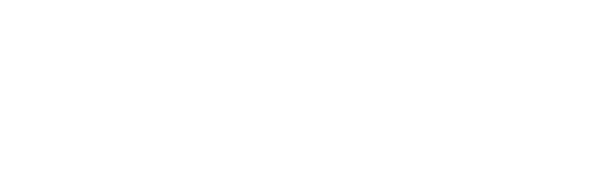

<p align="center">
    <a href="https://openbotx.ai" target="_blank" rel="noopener noreferrer">
        
    </a>
    <br>
    <br>
    Official website for the OpenBotX project.
    <br>
</p>

<br>

# OpenBotX Website

This repository contains the source code for the official [OpenBotX](https://openbotx.ai) website.

Built with [Kaktos](https://github.com/paulocoutinhox/kaktos), a Python static site generator.

## Requirements

- Python 3.9+

## Development

```bash
python3 -m venv venv
source venv/bin/activate
pip install -r requirements.txt
python3 kaktos.py
```

## Build

```bash
python3 kaktos.py build
```

All files will be generated in the `build` folder.

## License

[MIT](http://opensource.org/licenses/MIT)

Copyright (c) 2026, Paulo Coutinho
